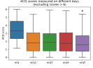

<link rel="stylesheet" href="report.css" type="text/css" />
<link rel="stylesheet" href="https://use.fontawesome.com/releases/v5.8.1/css/all.css" integrity="sha384-50oBUHEmvpQ+1lW4y57PTFmhCaXp0ML5d60M1M7uH2+nqUivzIebhndOJK28anvf" crossorigin="anonymous">

## Appendix

### Tables

<a name="table2"><b>Table 1</b></a>.
Spearman's correlation coefficient between the demographic and medical history features provided in the dataset and ΔACQ, the change in ACQ scores between the first administration of the questionnaire and the average of the subsequent four administrations of the questionnaire. N corresponds to the number of rows where the given feature is not null.

| Feature name       | Spearman's ρ | p-value |        N |
| :----------------- | -----------: | ------: | -------: |
| gender             |      -0.3964 |  0.0678 |  22.0000 |
| retire             |      -0.1995 |  0.0930 |  72.0000 |
| arthritis          |       0.1514 |  0.1214 | 106.0000 |
| vaccine            |      -0.1507 |  0.1230 | 106.0000 |
| CVD                |       0.1419 |  0.1469 | 106.0000 |
| age                |      -0.1186 |  0.1582 | 143.0000 |
| sex                |      -0.1190 |  0.1935 | 121.0000 |
| smoking            |      -0.1234 |  0.2077 | 106.0000 |
| allergy            |       0.1093 |  0.2648 | 106.0000 |
| polyps             |      -0.1040 |  0.2885 | 106.0000 |
| eos300             |       0.0901 |  0.2969 | 136.0000 |
| Prev-biologic      |       0.0944 |  0.3359 | 106.0000 |
| race               |      -0.0390 |  0.6436 | 143.0000 |
| co-yellowfever     |      -0.0366 |  0.6644 |   1.0000 |
| co-heartfailure    |       0.0977 |  0.6818 |  20.0000 |
| co-asthma          |      -0.0827 |  0.7289 |  20.0000 |
| co-pneumonia       |       0.0766 |  0.7413 |  21.0000 |
| co-diabetes        |       0.0727 |  0.7541 |  21.0000 |
| co-copd            |       0.0966 |  0.7653 |  12.0000 |
| disab              |       0.0251 |  0.7664 | 143.0000 |
| work               |      -0.0141 |  0.8676 | 143.0000 |
| weight             |       0.0162 |  0.8691 | 106.0000 |
| bmi                |      -0.0147 |  0.8813 | 106.0000 |
| height             |       0.0129 |  0.8959 | 106.0000 |
| co-arthritis       |      -0.0101 |  0.9043 |   5.0000 |
| demographics_table |       0.0009 |  0.9911 | 143.0000 |
| medhistory_table   |       0.0009 |  0.9911 | 143.0000 |

<a name="table2"><b>Table 1</b></a>.
Spearman's correlation coefficient between the demographic and medical history features provided in the dataset and <em>ΔACQ-lt1</em>, a boolean value which is true if the ACQ scores decreased by more than one point between the first administration of the questionnaire and the average of the subsequent four administrations of the questionnaire. N corresponds to the number of rows where the given feature is not null.

| Feature name       | Spearman's ρ | p-value |        N |
| :----------------- | -----------: | ------: | -------: |
| age                |       0.2017 |  0.0157 | 143.0000 |
| retire             |       0.2663 |  0.0238 |  72.0000 |
| sex                |       0.1554 |  0.0887 | 121.0000 |
| co-diabetes        |      -0.3464 |  0.1240 |  21.0000 |
| race               |       0.1172 |  0.1632 | 143.0000 |
| gender             |       0.2844 |  0.1996 |  22.0000 |
| CVD                |      -0.1242 |  0.2047 | 106.0000 |
| co-pneumonia       |      -0.2066 |  0.3689 |  21.0000 |
| co-yellowfever     |       0.0734 |  0.3835 |   1.0000 |
| arthritis          |      -0.0702 |  0.4746 | 106.0000 |
| allergy            |      -0.0691 |  0.4818 | 106.0000 |
| disab              |      -0.0576 |  0.4945 | 143.0000 |
| Prev-biologic      |      -0.0655 |  0.5049 | 106.0000 |
| vaccine            |       0.0649 |  0.5086 | 106.0000 |
| work               |       0.0503 |  0.5506 | 143.0000 |
| co-asthma          |       0.1307 |  0.5828 |  20.0000 |
| co-heartfailure    |      -0.1307 |  0.5828 |  20.0000 |
| eos300             |      -0.0468 |  0.5885 | 136.0000 |
| co-copd            |       0.1690 |  0.5995 |  12.0000 |
| smoking            |       0.0377 |  0.7013 | 106.0000 |
| medhistory_table   |       0.0181 |  0.8306 | 143.0000 |
| demographics_table |       0.0181 |  0.8306 | 143.0000 |
| weight             |      -0.0203 |  0.8366 | 106.0000 |
| height             |      -0.0169 |  0.8638 | 106.0000 |
| co-arthritis       |       0.0129 |  0.8785 |   5.0000 |
| bmi                |       0.0065 |  0.9469 | 106.0000 |
| polyps             |       0.0032 |  0.9744 | 106.0000 |

<a name="table2"><b>Table 2</b></a>.
LightGBM parameters which were evaluated using grid-search. The accuracy of each trained classifier was evaluated using 10-fold cross-validation, and the parameters that produced a classifier with the highest cross-validation accuracy are provided in the "Final value" column.

| Parameter name          | Values attempted                       | Final value |
| ----------------------- | -------------------------------------- | ----------- |
| boosting_type           | `["gbdt"]`                             | `"gbdt"`    |
| learning_rate           | `[0.001, 0.005, 0.01, 0.05, 0.1, 0.2]` | `0.1`       |
| num_leaves              | `[2, 4, 6, 8, 12, 16, 24, 32]`         | `6`         |
| num_iterations          | `[5, 10, 20, 50, 100, 200]`            | `5`         |
| min_sum_hessian_in_leaf | `[0]`                                  | `0`         |
| min_data_in_leaf        | `[1, 5, 10, 20]`                       | `10`        |
| max_bin                 | `[15, 31, 63, 123, 255]`               | `31`        |

  

### Figures

<figure class="fig">

  

    
  

<figcaption><a name="figure1"><b>Figure 1</b></a>.
Box-plot showing the difference in height between the individuals who were enrolled in the study (as evinced by their presence in the ACQ table) and individuals who were <em>not</em> enrolled in the study. The difference is significant (p-value < 0.05; two-sided t-test).
</figcaption>
</figure>

<figure class="fig">

  

  

    
A

    
  

  

  

    
B

    
  

  

<figcaption><a name="figure2"><b>Figure 2</b></a>.
<b>(A)</b> Line-plot showing changes in ACQ scores of all individuals enrolled in the study. Most individuals had four follow-up measurements around 10, 20, 40, and 100 days after the initial survey was conducted. Participants whose ACQ score was reported to be higher than 6 were excluded from our analysis since the maximum ACQ score is 6, and the pattern of ACQ scores for those individuals is distinctly different from the pattern shown by the majority of the participants. <b>(B)</b> Box-plot showing the distribution in ACQ scores for the initial visit and the four subsequent follow-ups for participants whose reported ACQ score was ≤ 6 throughout the study.
</figcaption>
</figure>

<figure class="fig">

  

    
  

<figcaption><a name="figure3"><b>Figure 3</b></a>.
Visualization of a decision tree trained to predict whether the ACQ score of an individual will decrease by at least 1 point on average over the four follow-up surveys. A decision tree allows for intuitive visualization of how the interaction between different features is predictive of a particular outcome.
</figcaption>
</figure>

<figure class="fig">

  

    
  

<figcaption><a name="figure4"><b>Figure 4</b></a>.
A confusion matrix corresponding to the decision tree displayed in <a href="#figure3">Figure 3</a>. The predicted values shown in the matrix correspond to predictions made by the trained decision trees in 5-fold cross-validation. The overall validation accuracy of the decision trees is 59.44%.
</figcaption>
</figure>

<figure class="fig">

  

    
A

    
  

  

    
B

    
  

  

    
C

    
  

  

    
D

    
  

  

    
E

    
  

  

    
F

    
  

<figcaption><a name="figure5"><b>Figure 5</b></a>.
<b>(A)</b> Feature importance of a stochastic gradient-boosted decision tree classifier (SGBDT) trained to predict whether an individual will have a decrease in their average ACQ score over the four follow-up surveys of at least 1 point. Age is the most important feature, involved in 5 splits inside the decision trees, followed by CVD, involved in 3 splits, and <em>retire</em>, involved in 2 splits. <b>(B)</b> Histogram showing predictions made by trained SGBDT classifiers during 10-fold cross-validation for individuals who either showed a decrease in the average ACQ score over the four follow-up surveys of at least 1 point (blue) or did not show such a decrease (orange). With a threshold of 0.5, the SGBDT classifier shows an accuracy of 61.54%, which is marginally higher than the accuracy achieved by the decision tree classifier (see <a href="#figure4">Figure 4</a>). <b>(C)</b> The receiver operator characteristic curve showing the trade-off between the false positive rate and the true positive rate for predictions made by trained SGBDT classifiers during 10-fold cross-validation. The area under the receiver operator characteristic curve is 0.593, which is higher that what would be expected from a classifier guessing at random (black dashed line). <b>(D-F)</b> Partial dependence plots showing the effect that <em>age</em> <b>(D)</b>, <em>CVD</em> <b>(E)</b>, and <em>retire</em> <b>(F)</b> features have on the predictions made by the classifier. An age greater than 35, a CVD less than 0.4, and being retired, are all associated with a higher probability of an at least 1 point decrease in the ACQ score over the course of the study. In younger individuals, the CVD score has a decreased effect on the prediction of the network <b>(E)</b>, while in people with a low CVD score, age has an <em>increased</em> effect on the prediction of the network <b>(D)</b>.
</figcaption>
</figure>
